# RiseKeeper Support

RiseKeeper is the alarm that makes sure you are awake, not merely that you heard it.

<section class="rk-showcase" aria-labelledby="app-previews">
  <h2 id="app-previews">App previews</h2>
  
See the complete RiseKeeper experience in the free app and with RiseKeeper Pro unlocked.

  

    <figure class="rk-video-card">
      <video controls playsinline preload="metadata" poster="assets/showcase/6.5/list.jpg">
        <source src="assets/showcase/normal.mp4" type="video/mp4">
        <a href="assets/showcase/normal.mp4">Download the Normal preview</a>.
      </video>
      <figcaption>Normal experience</figcaption>
    </figure>

    <figure class="rk-video-card">
      <video controls playsinline preload="metadata" poster="assets/showcase/6.5/pro.jpg">
        <source src="assets/showcase/pro.mp4" type="video/mp4">
        <a href="assets/showcase/pro.mp4">Download the Pro preview</a>.
      </video>
      <figcaption>RiseKeeper Pro</figcaption>
    </figure>
  

  <h2 id="screenshots">Screenshots</h2>
  

    <figure class="rk-screenshot-card">
      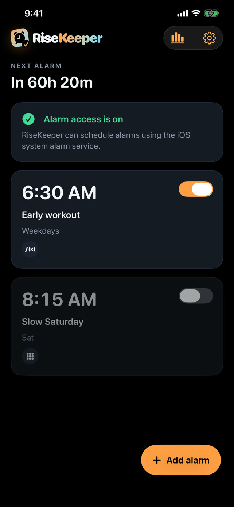
      <figcaption>Alarm list</figcaption>
    </figure>
    <figure class="rk-screenshot-card">
      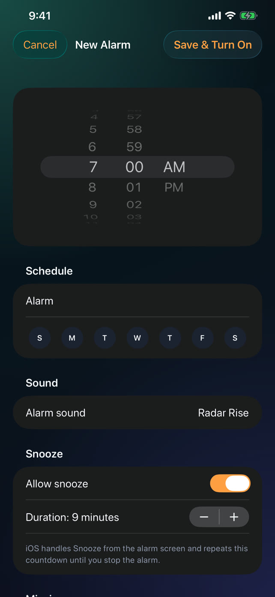
      <figcaption>Alarm editor</figcaption>
    </figure>
    <figure class="rk-screenshot-card">
      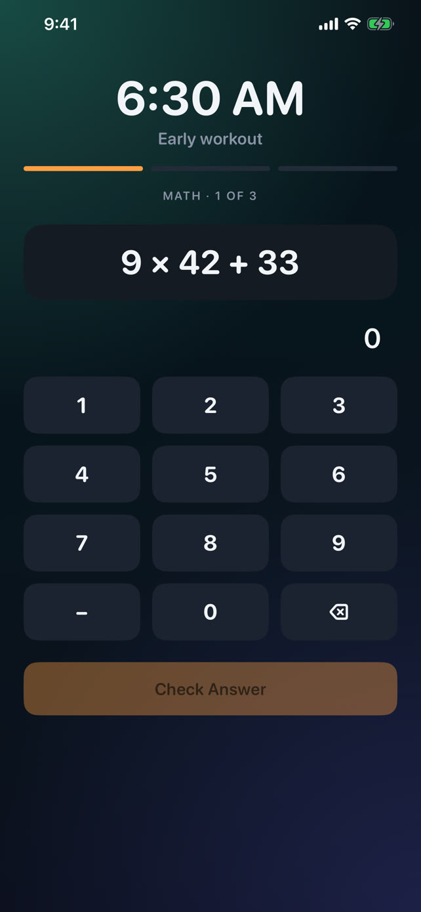
      <figcaption>Math mission</figcaption>
    </figure>
    <figure class="rk-screenshot-card">
      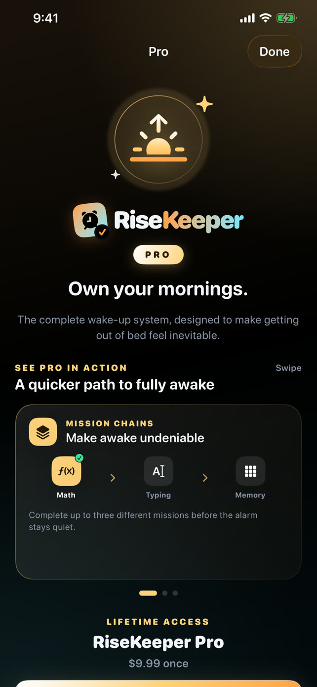
      <figcaption>RiseKeeper Pro</figcaption>
    </figure>
    <figure class="rk-screenshot-card">
      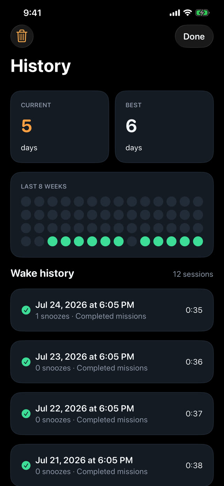
      <figcaption>Wake history</figcaption>
    </figure>
    <figure class="rk-screenshot-card">
      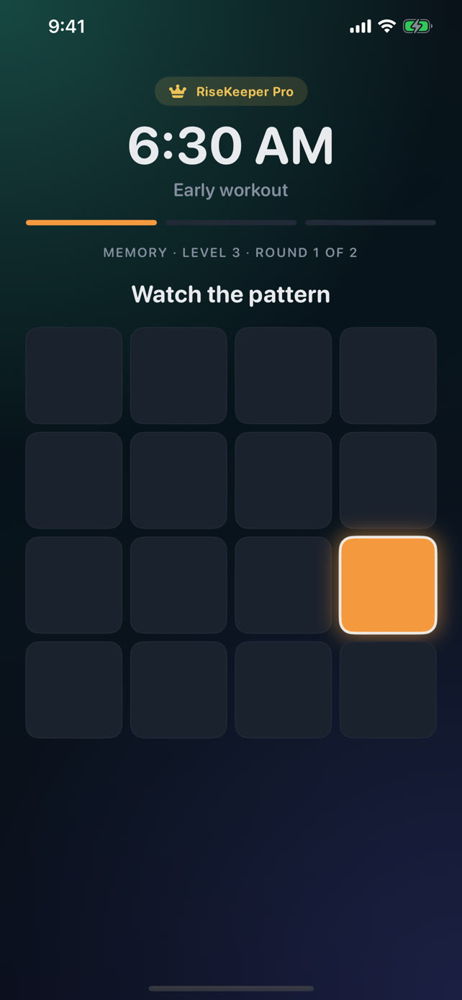
      <figcaption>Memory mission</figcaption>
    </figure>
  

  

    
View 6.9-inch display screenshots

    

      <figure class="rk-screenshot-card">
        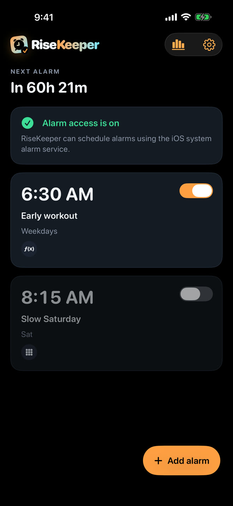
        <figcaption>Alarm list</figcaption>
      </figure>
      <figure class="rk-screenshot-card">
        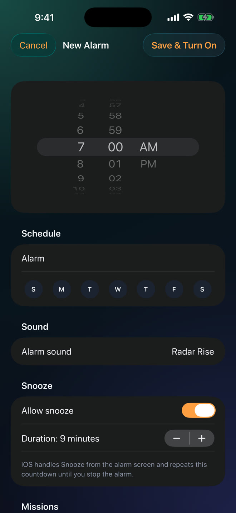
        <figcaption>Alarm editor</figcaption>
      </figure>
      <figure class="rk-screenshot-card">
        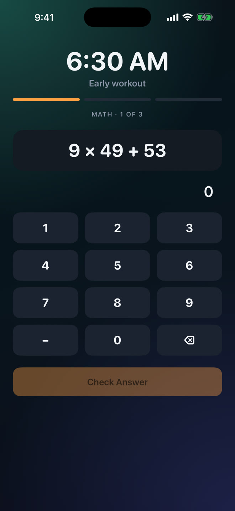
        <figcaption>Math mission</figcaption>
      </figure>
      <figure class="rk-screenshot-card">
        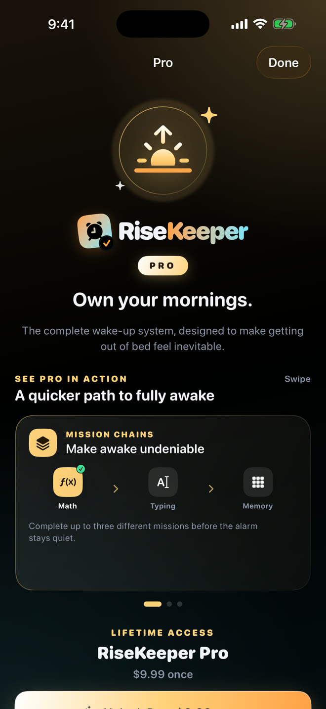
        <figcaption>RiseKeeper Pro</figcaption>
      </figure>
      <figure class="rk-screenshot-card">
        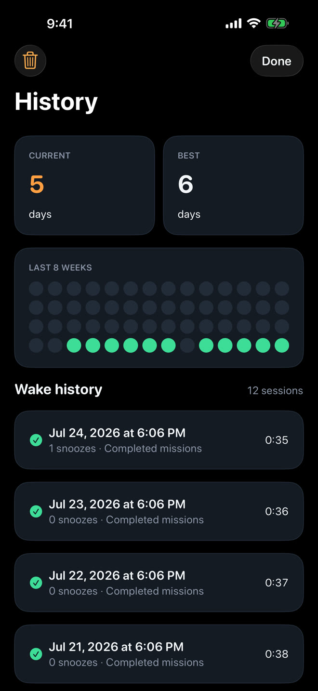
        <figcaption>Wake history</figcaption>
      </figure>
      <figure class="rk-screenshot-card">
        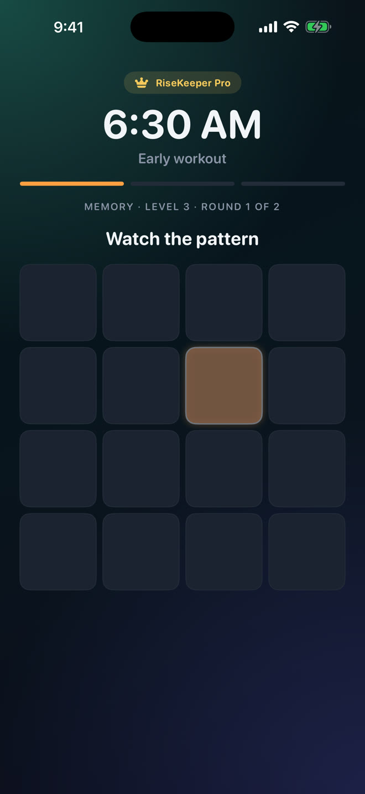
        <figcaption>Memory mission</figcaption>
      </figure>
    

  

</section>

## Getting started

1. Allow RiseKeeper to schedule system alarms.
2. Create an alarm and choose its days, sound, snooze policy, and wake-up mission.
3. When it rings, tap **Start Mission** and complete the challenge.

## Troubleshooting

### My alarms do not appear

Open iOS Settings and make sure alarm access is enabled for RiseKeeper. Then open the app once so it can reconcile its saved alarms with AlarmKit.

### Why can the system Stop button still appear?

iOS always provides a system-controlled Stop affordance. RiseKeeper Strict Mode detects a bypass and can schedule a short re-alarm; Wake-Up Check offers an additional safeguard.

### How do I restore RiseKeeper Pro?

Open **Settings → RiseKeeper Pro → Restore Purchases**. The lifetime purchase is linked to the Apple Account used to buy it. RiseKeeper Pro is not a subscription.

### How do I change the app icon?

Open **Settings → App Icon** and choose Classic, Aurora, Obsidian, or Hyper. Classic is available to everyone; the three alternate icons are included with RiseKeeper Pro. iOS displays a confirmation after the icon changes.

## Contact

Email [risekeeper.help@outlook.com](mailto:risekeeper.help@outlook.com) for support. Include your iPhone model, iOS version, and a short description of what happened. Do not send passwords, verification codes, or other sensitive information.

- [Privacy policy](https://whuang1101.github.io/RiseKeeper/privacy/)
- [Terms of use](https://whuang1101.github.io/RiseKeeper/terms/)
- [Sound licenses](https://whuang1101.github.io/RiseKeeper/sound-licenses/)
